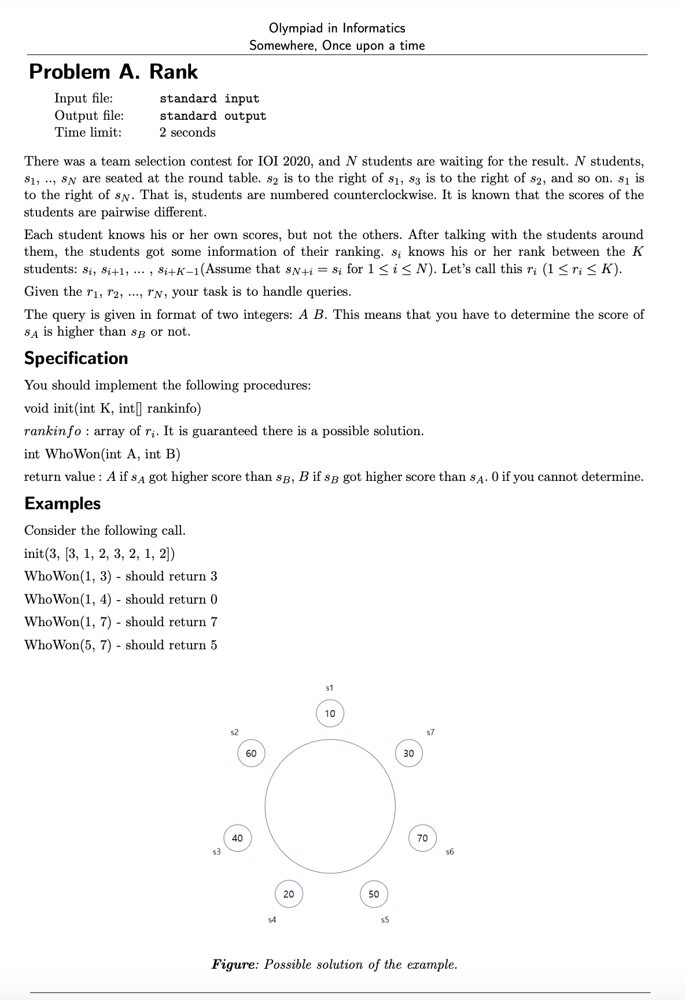
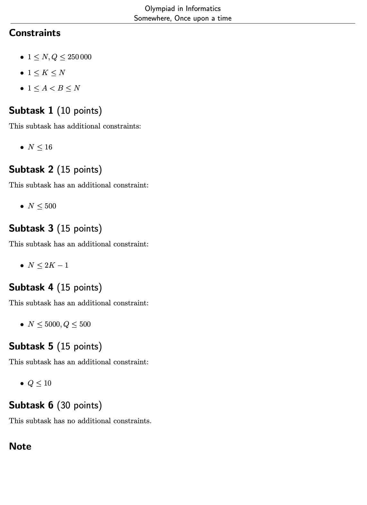

# SNUPC 2020 출제후기

SNUPC 2020에는 Div.1의 총 9문제중 절반 정도에 해당하는 4문제를 출제하였다. 여기서도 나름 마음에 드는 문제를 낼 수 있어서 만족스러웠다. 그리고 imeimi2000, TAMREF 등 여러 출제진 검수진들이 고생해 준 덕분에 문제 데이터와 지문의 퀄리티가 올라가서 성공적인 대회가 될 수 있었던 것 같다.

### A. 빈 문자열 만들기

링크 : https://www.acmicpc.net/problem/19848

같은 개수의 0과 1로 이루어진 문자열이 주어진다. 01, 0011, 000111 처럼 0 k개 뒤에 1 k개가 오는 문자열이나 1100처럼 1 k개 뒤에 0 k개가 오는 문자열을 지울 수 있을 때, 최소 횟수로 지워서 빈 문자열을 만드는 방법을 구하는 문제이다.

얼핏보면 굉장히 간단한 스택 연습문제처럼 보이지만, 실제 지우는 방법을 찍어야하기 때문에 약간은 고민이 필요한 문제이다. 그러고 보니 special judge를 O(N log N)에 구현했는데, 이것도 적당한 난이도의 하나의 문제가 될 수 있을 것 같다.

### C. 전국일주

링크: https://www.acmicpc.net/problem/19853

이 문제는 SNUPC에서는 처음 시도해보는 interactive 형식 문제였다. interactive 형식 문제는 ioi처럼 함수형으로 할 수도 있고, 아니면 위 문제와 같이 입력과 출력을 이용하는 방식이 있을 수 있다. 처음에는 O(N)번의 질문으로 해결하는 알고리즘을 모두 맞게 해주려고 했는데, 2N짜리 깔끔한 풀이가 나와서 2N으로 줄이기로 결정했다. 사실 너무 유사한 문제가 있어서(https://www.acmicpc.net/problem/19614) 조금 아쉬움이 남는 문제이다.

이 문제의 interactor를 만들 때 가장 적대적으로 만들고 싶었는데, 택한 방법은 인접한 edge들의 종류 중 더 적은 종류로 선택하는 방법이었다. 이것보다 더 좋은 방법이 있는지 찾는 것도 challenging한 문제가 될 수 있겠다.

### H. 계주 코스 정하기

링크: https://www.acmicpc.net/problem/19856

이 문제는 뒤에 나올 비운의 문제가 풀이가 틀린 것으로 밝혀져 급하게 준비한 어려운 문제인데, 급하게 준비한 것 치고 맘에 드는 문제가 나와서 만족스러웠다.

이 문제와 관련이 있는 문제로는 어떤 ( 와 )로 이루어진 문자열 S와 T가 주어졌을 때, S와 T를 interleaving시켜서 만든 하나의 새로운 문자열 P가 올바른 괄호 문자열이 되도록 할 수 있는지에 대한 문제가 있다. 

위 문제에 대한 힌트는 ( 를 +1, ) 를 -1이라고 생각했을 때, 결국 계주 코스 정하기 문제와 같이 $$A[i]+B[j] >= 0$$인 (i,j)만 지나서 (N,M)에 도착하는 문제로 생각할 수 있다는 점이다. 

이 문제와 비슷한 아이디어를 사용하는 문제로는 https://oj.uz/problem/view/JOI17_sparklers 와 https://www.acmicpc.net/problem/13208 등이 있는데, 둘다 꽤 재미있는 문제들이니 풀어보기를 추천한다. 좀더 어려운 문제로는 역시 본인이 출제에 참여한 https://www.acmicpc.net/problem/15943가 있다.

### I. 연금술사

링크 : https://www.acmicpc.net/problem/19857

이 문제는 쉽지 않은 문제라고 생각을 하고 출제를 했는데 참가자들이 굉장히 잘 푼 문제이다. 간단한 그리디 풀이가 있지만 그 그리디 풀이가 맞다는 것을 증명하는 것은 어렵고 귀찮은 작업을 동반한다. 그리고 지문을 이해가 되게 쓰는 것도 좀 까다로운 문제였다. 난이도가 높지 않은 아이디어성 문제이니 도전해 보면 좋을 듯 하다.

### 비운의 문제. LIS LDS

원래 H번 대신 내려고 했던 문제로 LIS LDS가 있다.

1부터 N까지의 순열이 주어졌을 때, 이를 최소 개수의 increasing subsequence 와 decreasing subsequence로 분리하는 문제이다.

예를 들어, 1 6 2 4 5 3 가 있다면 [1 2 4] [6 5 3]의 2개로 분리할 수 있으며 이 때가 최소이다. 

주어진 순열에 대해, https://en.wikipedia.org/wiki/Robinson%E2%80%93Schensted_correspondence 의 Schensted algorithm을 이용해 영 다이어그램을 만들었을 때,

A개의 x축에 평행한 직선과 B개의 y축에 평행한 직선으로 영 다이어그램의 모든 정사각형을 cover할 수 있다면
A+B개의 increasing subsequence와 decreasing subsequence로 수열을 모두 cover할 수 있음을 보일 수 있다.
그 성질을 이용해서 조건을 만족하는 A+B 중 최솟값을 구하면 문제를 해결할 수 있다고 생각했다.
그러나, 그것보다 더 적은 개수로 cover 가능한 수열이 있음이 밝혀져 문제를 쓸 수 없게 되고 말았다(challenge: 반례인 수열을 직접 찾아보세요).

이 문제를 소개한 김에 increasing subsequence에 대한 몇 가지 성질과 quiz를 내보고자 한다.

1. 수열이 주어졌을 때, Schensted algorithm을 이용하여 k개의  increasing subsequence로 덮을 수 있는 element의 최대 개수를 구할 수 있다. 이는 구한 young diagram에서 위 k개 행에 포함되는 수 개수와 같다.
2. 어떤 K에 대해, K개의 increasing subsequence로도 cover할 수 없고 K개의 decreasing subsequence로도 cover할 수 없는 최소 길이의 순열의 길이를 f(K)로 나타내시오.
3. 길이 N인 수열에 대해, f(K)>N인 최소 K에 대해 수열을 K개의 increasing subsequence 또는 decreasing subsequence로 나누는 방법을 구하시오. 시간복잡도는 $$O(N sqrt(N))$$
4. 위에서 "영 다이어그램을 A개의 x축에 평행한 직선과 B개의 y축에 평행한 직선으로 다 cover할 수 있으면 A+B개의 increasing subsequence와 decreasing subsequence로 수열을 모두 cover할 수 있음을 보일 수 있다" 라고 했는데, 이를 증명하시오.

위에서 말한 성질들을 알고 있다면 https://www.acmicpc.net/problem/18594 같은 문제들을 쉽게 해결할 수 있다.

# IOI 2020 출제후기

IOI는 나 자신도 2014, 2015년에 두 번 출전했고, 그 이후로 국가대표 교육도 여러 번 진행하면서 개인적으로는 무척 애착이 있는 대회이다. 실제로도 competitive programming 범주 내에서 가장 큰 규모의 대회라고 볼 수도 있다.
그런 대회에 자신의 문제가 나온다고 하니 감회가 참 새로웠다.

출제에 비하인드가 좀 있는데, IOI는 여타 올림피아드가 그렇듯 처음부터 6문제를 선정하는 것이 아니라 조금 더 많은 문제를 받아서 예비 문제로 올려놓는다. 그래서 내 문제가 쓰일지 쓰이지 않을지는 대회 또는 그 전날의 meeting 전까지 알 수가 없다. 그런데 이번 ioi는 COVID-19 때문에 온라인으로 치뤄졌기 때문에 나는 그 meeting에도 초대받지 못했고, cheat issue 때문에 스코어보드조차 볼 수 없었기 때문에 결국 day 1이 종료되고 모든 결과가 공개된 후에야 내 문제가 day 1에 1번으로 출제되었다는 것을 알 수 있었다. 솔직히 나름 괜찮은 문제를 만들었다고 생각해서 쓰이지 않는다면 어쩌나 하고 마음 졸였는데 call for tasks에 제출한지 9개월이 다 되서야 확인을 할 수 있어서 조금 답답했다.

 

이 문제는 작년에 Petrozavodsk Programming Camp 라는, 러시아에서 열리는 icpc 대비용 캠프를 갔을 때 돌아오는 비행기에서 생각했던 문제이다. 그곳의 문제들에서 영향을 얻은 것은 아니고, 비행기에서는 할 짓이 없어서 여러 가지 생각을 하게 되다보니 문제가 가끔 나오곤 한다. 요즘은 비행기를 탈 일이 없어서 출제가 잘 안 되나..

plants 문제에 대한 풀이는 블로그의 다른 글에도 상세하게 나와 있으며, IOI 공식 홈페이지에서도 자세하게 나와 있으니 특별하게 다루지는 않겠다. 그보다는 문제를 생각하게 된 배경에 대해 조금 이야기해보고자 한다. 좀전에 말한 러시아 캠프에 있을 때, 우리 팀(Cafe Mountain: ainta, cki86201, tlwpdus)은 functionx님이 주최하는 functioncup4를 가상 참가 했었는데, 거기에서 wine(https://oj.uz/problem/view/FXCUP4_wine) 문제에 대해 생각하면서 와인들을 비교할 때 원형으로 늘어놓고 가까운 위치의 와인들만 비교함으로써 와인들을 맛있는 순서대로 정렬할 수 있을까? 라는 생각을 했었다. 물론 와인 문제는 그렇게 풀리지 않았기 때문에 결과적으로는 풀지 못했지만.. 아무튼 그런 생각을 잠시 했다가 비행기에서 다시 떠올라서 생각해보니, 원형으로 와인을 배치했을 때 각 와인에 대해 시계방향으로 r개의 와인에 대한 자신의 와인의 등수만 알고 있다면 각 r개의 와인에 대해 자신보다 맛있는지 맛없는지를 알 수 있다는 사실을 증명할 수 있었다. 그래서 ioi_plants 문제의 버전 1이 완성되었다 (버전 1은 각 식물의 등수가 주어질 때, 각 식물의 전체 등수로 가능한 해 1가지를 리턴하는 문제였다). 개인적으로는 비행기에서 이를 증명할 때가 Problem solving을 하면서 가장 즐거웠던 순간중 하나였던 것 같아서 좋은 기억으로 남아있다.

버전 2, 즉 ioi에 출제된 버전의 문제는 나중에 한국으로 돌아와서 생각한 것인데, 이것도 내 생각에는 아주 뻔한 풀이는 아니었기 때문에, 그리고 데이터가 보다 강할 수 있기 때문에 결과적으로 버전 2를 만든 것은 잘한 선택이었던 것 같다. 버전 1, 2를 모두 ioi committee에 제출했는데, 메일을 보낼때 RSA 키 (ECC였을 수도 있다)를 받아서 암호화하고 복호화하고 이런걸 해본건 처음이었어서 약간 헷갈렸다. 문제가 후보로 최종 선정되었다는 것은 3월에 알려주었고, 6월 말에는 private한 Git Repository를 받아서 거기에서 문제에 대한 작업을 진행하였다.. 사실 ioi committee분께서 subtask를 좀 많이 수정하셨고 거기에 대한 솔루션과 데이터도 아예 새로 만드셨다. 데이터를 만들어주신건 되게 편하고 좋았지만, 서브태스크에 대해서는 약간 의견이 맞지 않아서 수정 과정을 거치기도 했다. 결론적으로는 데이터를 만들지 않고 문제 출제를 할 수 있어서 아주 좋았다.

나는 이번에 처음으로 call for tasks에 문제를 넣었는데 선정이 되었고, call for task에 그렇게 많은 문제가 모이지는 않는 것 같으니 혹시 IOI에 출제를 해보고 싶은 사람은 부담없이 출제를 해도 선정될 가능성도 꽤 있고 좋은 경험이 될 것 같다. ioi 홈페이지에 가면 call for tasks 하는 방법은 자세하게 나와있다.

아래에는 사람들이 ioi 출제를 하는 데 도움이 될까 하여 call for tasks에 실제로 냈던 파일을 첨부하였다.

 
 
 

위에서 볼 수 있듯이, 문제 설명과 간단한 풀이, 그리고 소스 코드 정도를 제출하면 된다. 데이터는 예제 이상으로 만들 필요는 없는 듯 하다. 즉 문제를 만들 때 스트레스의 절반 이상을 차지하는 데이터 강화를 하지 않아도 되는 셈이다.

사실 올해 IOI 문제의 전반적인 퀄리티는 예년에 비해 조금 떨어지는 편이라고 생각이 되는데, 학생들은 점점 수준이 올라가는 만큼 좀더 많은 사람들이 ioi call for tasks에 참여하여 높은 퀄리티의 대회를 만들었으면 좋겠다.
